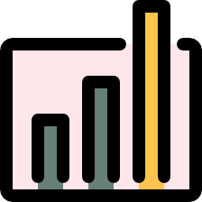

---

<!-- Статистика gh аккаунта -->

##  Статистика профиля

<table>
  <tr>
    <td style="border: none">
      
    </td>
    <td style="border: none">
      
    </td>
  </tr>
  <tr>
    <td style="border: none">
        
    </td>
    <td style="border: none">
      
    </td>
  </tr>
</table>

---

<!-- Стек технологий -->

##  Стек технологий

| **Категория**              | **Технологии**                 |
| -------------------------- | ------------------------------ |
| **Языки программирования** | Java, JavaScript, Python, C++  |
| **Фреймворки**             | Spring, React, Angular, Django |
| **Базы данных**            | PostgreSQL, SQLite             |
| **Инструменты разработки** | Git, Docker, Linux             |
| **Системы CI/CD**          | GitHub Actions                 |
| **Другие технологии**      | LaTeX                          |

---

<!-- Проекты -->

##  Проекты

| **Название**         | **Стек**               |                                                                             **Ссылка**                                                                             |
| -------------------- | ---------------------- | :----------------------------------------------------------------------------------------------------------------------------------------------------------------: |
| SpaceMarine          | Java (Spring), Angular |               |
| StackLispVM          | Python                 |               |
| Particle Focusing    | JavaScript             |  |
| OtakuNote            | Python (Django), JS    |                |
| Tranfermarkt Parser  | Python, BS4            |       |
| OfflineEventPlatform | Java (Sping), Angular  |                                                                            coming soon                                                                             |

---

<h2>
     Контакты
</h2>
<ul style="list-style: none; padding: 0;">
    <li>
        
    </li>
    <li>
        
    </li>
    <li>
        
    </li>
</ul>
